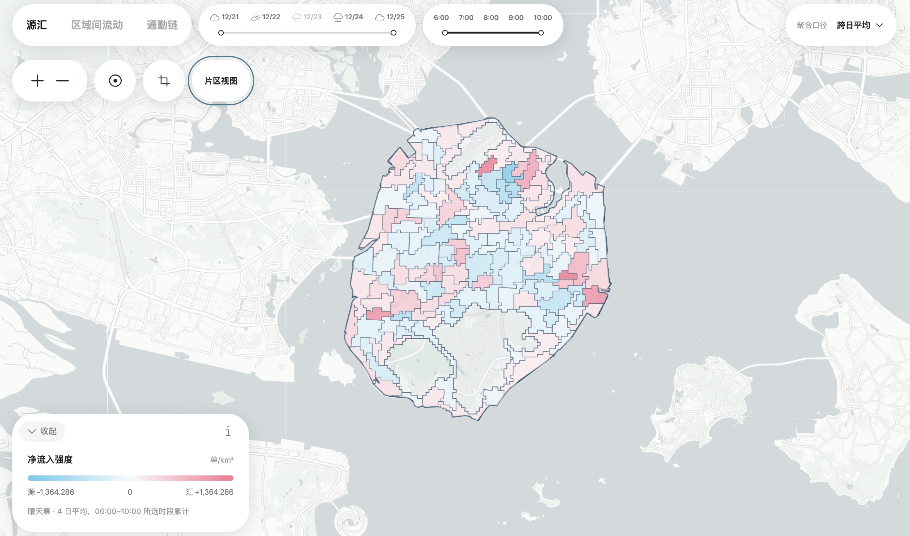

# 厦门本岛早高峰共享单车流动模式分析

## 项目简介

本项目分析 2020 年 12 月 21 日至 25 日 6:00–10:00 的厦门共享单车订单与 GPS 轨迹，研究厦门本岛工作日早高峰的源汇区域和区域间流动模式。

项目使用 PySpark 清洗并切分轨迹，通过 HMM/Viterbi 将轨迹匹配到 OpenStreetMap 自行车路网，再从 150 米网格流网络中发现区域。分析结果包括区域源汇与过境画像、出行流、通道流和典型通勤链。处理结果发布到 MobilityDB/PostGIS，由 FastAPI 提供查询接口，并通过 Vue、Leaflet 和 ECharts 展示。



## 运行应用（Windows 11）

项目包已包含 `.env` 和 `data/processed/`，无需重新处理数据。首次运行前安装 [Docker Desktop](https://docs.docker.com/desktop/setup/install/windows-install/)、[Node.js 22.12 或更新版本](https://nodejs.org/en/download) 和 [uv](https://docs.astral.sh/uv/getting-started/installation/)。Docker Desktop 需使用 WSL 2 和 Linux containers。

在 PowerShell 中进入项目目录并安装依赖：

```powershell
cd C:\path\to\find-bike-routes
uv sync --locked --no-dev
npm.cmd --prefix frontend ci
```

启动数据库：

```powershell
docker compose up -d --wait
```

新电脑首次启动时，执行一次数据导入：

```powershell
@'
import os
import runpy
from psycopg.conninfo import make_conninfo

os.environ["MOBILITYDB_DSN"] = make_conninfo(
    host="127.0.0.1",
    port=os.environ.get("MOBILITYDB_PORT", "5432"),
    dbname="bike_routes",
    user="bike_routes_import",
    password=os.environ["BIKE_ROUTES_IMPORT_PASSWORD"],
)
runpy.run_path("scripts/import_dataset.py", run_name="__main__")
'@ | uv run --env-file .env python -
```

启动后端，并保持窗口运行：

```powershell
uv run --env-file .env uvicorn find_bike_routes.api:create_app --factory --host 127.0.0.1 --port 8000
```

另开一个 PowerShell 窗口，启动前端：

```powershell
cd C:\path\to\find-bike-routes
npm.cmd --prefix frontend run dev -- --host 127.0.0.1
```

浏览器打开 <http://127.0.0.1:5173>。以后再次使用时，只需启动 Docker Desktop、数据库、后端和前端，不必重新安装依赖或导入数据。

## 数据来源

Cai, J., Wen, Q., Chen, T. et al. [Comprehensive spatiotemporal dataset of shared bicycle operations in Xiamen China](https://doi.org/10.1038/s41597-025-06534-z). *Scientific Data* 13, 217 (2026).
