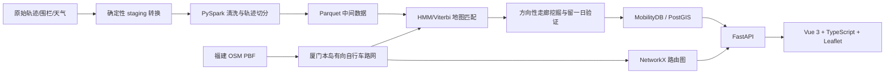

# 项目总体计划

## 一、项目定位与边界

项目名称定为：

> 厦门本岛工作日早高峰共享单车骑行走廊挖掘与约束式路线推荐系统

核心目标：

1. 从五个工作日早高峰 GPS 数据中恢复可信的独立轨迹。
2. 将轨迹匹配到 OSM 有向自行车路网。
3. 挖掘跨天稳定、具有方向差异的热门骑行走廊。
4. 根据起点、目标距离和路线类型推荐最多三条可解释路线。
5. 通过 Spark、MobilityDB、Web 应用和 SDD/Vibe Coding 过程材料覆盖课程各项要求。

项目主张分为两层，文档、验证与验收材料均按此区分：

- **C1（方法主张）**：一套与时段无关的挖掘管线——轨迹恢复 → HMM 地图匹配 → 按日归一化的方向性走廊挖掘 → 留一日验证 → 约束式路线生成。管线不包含早高峰特定假设：拆分阈值是物理量，热门度是当日轨迹占比，走廊规则是拓扑规则。换数据集时只需修改时段切片定义、支持天数等数据集参数，不变逻辑保持不动。
- **C2（实例结论）**：该管线在“厦门本岛五个工作日早高峰”数据上的输出。所有 C2 结论自带时空标签，不外推到其他时段。

结论边界：

- “热门”表示在该数据集中被稳定选择，不等同于道路更宽、更安全或具有自行车道。
- 结果只代表工作日早高峰；算法可迁移到其他时段，但当前数据不能证明全天规律。
- 订单 ID 不用于划分或验证轨迹，仅使用电子围栏数据支持“终点有还车点”约束。
- 天气只作为数据背景和分层统计，不用五天数据拟合天气权重。
- 10–20 km 路线可能主要依赖 OSM 构造，必须显示历史数据支持率。

首版不包括：指定终点路线推荐、地址搜索、景点推荐、调度策略、专门的沿海模式、右转优先、实时数据、HDFS 集群部署。

整体可行性为中高，难度中高但适合作为课程设计。主要风险是轨迹 ID 不可靠、五天早高峰的样本偏差、全量地图匹配计算量，以及长距离路线的历史覆盖不足。

## 二、总体架构



| 层次 | 框架 | 职责 |
|---|---|---|
| 数据源层 | 原始文件、OSM PBF | 原始数据只读保存；记录文件哈希、日期和 OSM 快照时间 |
| Staging 层 | Python 标准库、现有转换脚本 | 将伪装成 CSV 的 Excel 转为 UTF-8 CSV；写入稳定的 `source_row`；生成转换清单 |
| 大数据处理层 | PySpark 4.2、Spark DataFrame/SQL、Parquet | 全量读取、字段规范化、轨迹切分、质量过滤和每日统计 |
| 空间算法层 | osmium、Shapely、NetworkX | 本岛边界与路网提取、HMM/Viterbi 地图匹配、有向边序列恢复、走廊挖掘和候选路线生成 |
| 时空数据库层 | Docker Compose、PostgreSQL、PostGIS、MobilityDB | 保存轨迹时序对象、道路、走廊和电子围栏，提供空间查询与课程要求中的轨迹管理能力 |
| 服务层 | FastAPI、Pydantic、psycopg | 参数校验、候选路线计算、评分、解释和 GeoJSON API |
| 前端层 | Vue 3、TypeScript、Vite、Leaflet | 限制在厦门本岛的地图交互、起点选择、参数输入、走廊图层和前三路线对比 |
| 验证层 | pytest、Spark 数据断言、前端类型检查与构建 | 验证数据契约、算法约束、API 和端到端演示场景 |

PySpark 采用本地 `local[*]` 模式，不建设 HDFS 集群。保留 Python 3.13 和 pandas 3；只使用标准 Spark DataFrame/SQL，不使用 pandas-on-Spark、Spark Connect 或 pandas UDF，避免其 pandas `<3.0` 约束。当前机器缺少 Java，开发前安装 JDK 21 并设置 `JAVA_HOME`。PySpark 4.2 支持 Python 3.10+，并要求 Java 17 或更高版本。[Apache Spark 官方安装说明](https://spark.apache.org/docs/latest/api/python/getting_started/install.html)

MobilityDB 使用固定版本的 Docker 镜像，不使用 `latest`；它作为 PostgreSQL/PostGIS 的轨迹扩展运行。[MobilityDB 官方说明](https://docs.mobilitydb.com/MobilityDB/master/)

主要持久化对象：

- `trip`：轨迹 ID、日期、质量指标、长度、时长和 MobilityDB `tgeompoint`。
- `road_edge`：有向 OSM 边、几何、长度、道路标签、通行限制和热门度指标。
- `corridor`：走廊几何、方向、跨天支持、方向不平衡度和综合分。
- `fence`：电子围栏多边形。
- Parquet 保存清洗点、轨迹摘要、地图匹配边序列及每日聚合等可重复计算的中间结果；在线请求不持久化推荐路线。

## 三、实现顺序与算法设计

### 1. 固化数据契约和研究范围

- 准备唯一的厦门本岛 GeoJSON，排除鼓浪屿、岛外高校和跨海道路；清洗、OSM 提取和前端边界共用该文件。
- staging 转换时写入文件内稳定行号，不能在 Spark 中依赖分区顺序重新生成。
- 保存原始文件、转换文件、岛屿边界和 OSM PBF 的哈希及版本信息。
- 先建立小样本回归数据，再运行五天全量数据。

### 2. 使用 Spark 划分和筛选轨迹

按原文件顺序向下填充 `BICYCLE_ID`，组合日期与时间。相邻记录出现以下任一情况时开始新轨迹：

- 时间不递增；
- 间隔超过 120 秒；
- 速度超过 12 m/s；
- 空间跳跃超过 1,000 米。

轨迹级筛选与质量分级遵循一条原则：**权重衡量“该轨迹的用边证据有多可信”，不衡量“该骑行有多好”**。长度和平均速度是行为特征而非数据质量特征，不作为正向权重：长度只作下限过滤（每边每天一票的规则已使长轨迹天然覆盖更多边，再加权即重复计数）；速度只作合理性区间检查（按速度加权会系统性偏向干道快骑、压制绿道慢骑）。

轨迹级硬剔除默认采用：

- 至少 3 个点；
- 时长 60–3,600 秒；
- 地图匹配后长度至少 100 米；
- 点全部位于本岛边界 100 米容差内，且匹配道路必须位于本岛；
- 匹配率至少 80%，并剔除长时间连续无法匹配的轨迹；
- 移动范围过小：轨迹最远两点球面距离小于 150 米（挪车、找车位、运维摆放等原地打转，不含路线选择信息；正常的短距离直线骑行不受影响）；
- 停留为主：步速小于 0.5 m/s 的点占比超过 60%（停车状态 GPS 抖动）；
- 速度不可信：全程平均速度超过 7 m/s（共享单车持续该速度不可信，多为拆分未切开的拼接残留）；
- 推断段比例超过 30%。

通过硬剔除的轨迹按可信度分为两档，质量权重 \(q_t \in \{1.0, 0.5\}\)。出现以下任一情况降为 0.5，否则为 1.0：

- 采样稀疏：中位间隔超过 60 秒，或每公里少于 8 个匹配点；
- 吸附距离中位数在 20–40 米之间；
- 推断段比例在 10%–30% 之间；
- `path_breaks` 至少 1 次；
- 全程平均速度低于 1.5 m/s（可能长时间推车，路径信息仍有效）。

采用两档而非连续权重，保证每条规则可解释、可审计；上述阈值为默认值，冻结前须用 2020-12-21 全量分布校准一遍并记录校准依据。

明确保留、不惩罚：移动范围达标的短轨迹、起终点接近或闭合的轨迹、含逆行段的轨迹（逆行边按地图匹配规则单独处理，不牵连整条轨迹）。每条轨迹对同一有向边每天最多贡献一次支持，因此原地重复经过不会反复抬高该边计数。长轨迹不额外加权。

每个过滤与分级阶段必须同时输出保留数、拒绝数（或降权数）和原因，保证所有输入点均可追溯。

### 3. 构造自行车路网并完成地图匹配

- 从当前 OSM PBF 提取本岛道路，排除 `motorway`、`steps`、`construction`、`bicycle=no`、不可通行及私有道路。
- 按 `oneway`、`oneway:bicycle` 和反向自行车道标签构造有向图。
- 模块化现有 notebook 中的 HMM/Viterbi 方法：每个 GPS 点在 60 米内取最多 5 条候选边；发射概率依据吸附距离，转移代价依据 GPS 位移、道路连接关系和路网距离差。
- 最长 400 米的短连接段可用于连续路径恢复，但必须标记为 `observed` 或 `inferred`，保存直接观测覆盖率，避免无法辨认连接段对热门度的影响。
- 输出每条轨迹的有向边序列、吸附距离、匹配率、推断段比例和完整路径几何。

### 4. 挖掘方向性热门走廊

热门度以“轨迹数”而不是 GPS 点数计算。对有向边 \(e\) 和日期 \(d\)：

\[
p_{e,d} =
\frac{\text{当日经过该有向边的有效轨迹数}}
{\text{当日有效轨迹总数}}
\]

边的稳健热门分由以下部分组成：

- 五天每日归一化支持度的中位数（支持度按轨迹质量权重 \(q_t\) 加权求和，见轨迹质量分级）；
- 出现天数比例；
- 直接观测覆盖率。

门槛与权重分离：走廊准入门槛（总支持不少于 20 条轨迹、至少出现 3 天）一律使用不加权的原始轨迹计数判定，保证门槛不受权重函数影响；质量权重只进入热门分排序。须报告加权与不加权热门度的 Top-K 边排序重合率，若差异可忽略则最终采用不加权版本并如实记录该结论。

同一道路两个方向分别统计。方向不平衡度：

\[
I_e = \frac{n_{\text{正向}}-n_{\text{反向}}}
{n_{\text{正向}}+n_{\text{反向}}}
\]

只有总支持不少于 20 条轨迹、至少出现在 3 天且方向符号跨天稳定时，才显示明确方向标签。

方向不平衡度同时作为数据集时段形态的诊断量：通勤型数据预期呈现高不平衡且主方向指向就业与学校集中区，休闲型数据预期不平衡度低。全体高支持边的 \(I_e\) 分布及其与 POI 旁证的一致性，作为“本数据集呈现典型通勤形态”的挖掘结论正式报告；该诊断量与数据集无关，是方法可迁移性（C1）的证据之一。

走廊生成规则：

1. 选择至少出现 3 天且热门分位于前 10% 的有向边。
2. 根据真实轨迹中的连续边转移建立边—边图。
3. 在分叉点拆分，提取最大非分叉连续链。
4. 舍弃短于 300 米的片段。
5. 以边长加权平均热门分、跨天覆盖和轨迹支持排序。

使用 OSM 中住宅、商业、办公和学校等土地利用/POI，检查早高峰主方向是否具有通勤解释；该结果只作为合理性旁证，不作为标签或训练真值。

### 5. 留一日验证与权重确定

轮流以四天训练、一天验证，共五折：

- 比较训练期和留出日的边热门度相关性、Top-K 边重合率和走廊覆盖率。
- 对留出日真实轨迹，以相同起终点生成最短路线和热门度感知路线。
- 比较两者与真实地图匹配轨迹的有向边 F1、覆盖率和长度比。
- 在小型离散参数网格中选择平均表现最好的固定权重，并将结果写入版本化配置。
- 最终权重只确定一次，不在 Web 页面提供滑杆。

如果热门度模型没有稳定优于最短路，应如实记录，不继续扩展特征直至过拟合。

在留一日验证之外，增加时段切分伪泛化实验：将 6:00–10:00 切为 6:00–8:00 与 8:00–10:00 两个子数据集，各自独立完成走廊挖掘，比较 Top-K 有向边重合率、走廊几何重叠和方向不平衡度分布。留一日验证衡量跨天迁移，时段切分衡量跨时间片迁移；两者结果无论一致还是分化都如实报告——一致说明方法输出对切片稳健，分化说明方法能分辨时段形态，均支撑方法主张 C1。实验完全复用现有管线，只增加一组配置。

### 6. 构造推荐路线

所有候选先满足硬约束，再进行综合评分：

- 目标距离范围 1–20 km；
- 首次搜索允许 ±10% 偏差，不足 3 条时放宽至 ±15%；
- 只使用自行车合法道路；
- 环线除起点附近接入段外，重复无向边比例不得超过 10%；
- “终点有还车点”仅适用于单程路线。

候选生成：

- 单程：从目标路网距离附近的可达节点中选择终点；启用围栏约束时，只保留落在电子围栏内或其入口附近的终点。
- 往返：生成目标距离一半的去程，只使用可双向骑行道路，返程严格反向返回。
- 环线：从不同方位选取两个锚点，连接“起点—锚点 A—锚点 B—起点”，拒绝距离和重复率不合格的候选。
- 候选不足时返回实际数量，不复制相似路线凑满三条。

评分维度包括距离吻合度、热门走廊覆盖率、方向一致性、直接数据支持率、转弯简洁度和重复率。最终选择最多三条综合分最高且有向边 Jaccard 重合度不超过 0.7 的路线。

热度信号按路线类型取不同语义：`one_way` 使用有向边热门分并计入方向一致性；`out_and_back` 与 `loop` 使用物理路段级热门分（无向，取两方向较大值），方向不平衡度只作为展示信息、不进入惩罚项，避免早高峰强方向性系统性压低回程与环线的逆主方向段评分。边热度在路由评分器中实现为显式可替换接口（`edge_attractiveness(edge, direction)`），该接口是换数据集时的泛化接缝，在 SDD 设计文档中标注。

推荐功能的对外表述为“基于历史骑行热度的数据感知约束式路线构造”，不称为休闲路线推荐；Strava 式休闲推荐作为同一引擎更换数据集后的应用场景，在报告“推广与局限”一节讨论。

稀疏区域允许回退到纯 OSM 路线，但必须显示“历史数据支持不足”警告和真实热门覆盖率。

## 四、Web 接口与交互

核心接口：

- `GET /api/corridors`：返回走廊 GeoJSON，属性包含方向、热门分、支持天数和轨迹数。
- `GET /api/fences`：返回本岛电子围栏 GeoJSON。
- `POST /api/routes`：接收起点、距离、路线类型和围栏约束，返回最多三条路线。
- `GET /api/health`：检查 API、数据库和路由图是否可用。

`POST /api/routes` 请求：

```json
{
  "start": {"longitude": 118.1, "latitude": 24.5},
  "target_distance_km": 8,
  "route_type": "one_way",
  "require_fence": true
}
```

其中 `route_type` 取 `one_way`、`out_and_back` 或 `loop`。对往返或环线传入 `require_fence=true` 时返回参数错误。

每条路线响应包含：

- GeoJSON `LineString`；
- 实际距离、距离偏差和综合分；
- 热门走廊覆盖率、方向一致性、重复率和数据支持率；
- 一句推荐摘要；
- OSM 回退、候选不足等警告。

前端地图固定到厦门本岛并禁止在岛外选择起点。默认显示走廊图层，用户点击地图、输入距离、选择路线类型和围栏要求后查看最多三条不同颜色的路线，并可切换候选和查看分项指标。

前端固定展示“数据来源卡片”：注明数据为 2020 年 12 月五个工作日早高峰（6:00–10:00），热度语义为“通勤时段被骑行者稳定选择”，推荐结果反映的是该时段的路线偏好。局限性由产品显式声明，而非事后解释。

## 五、SDD、Vibe Coding 与验收材料

课程文档以仓库中的 SDD 为事实来源，Matt Pocock 工作流用于执行，不反向取代课程文档。Matt 本地 ticket 和 `AGENTS.md` 的安装配置由用户完成。

正式开发顺序：

1. 更新并评审 SDD。
2. 使用 `to-spec` 从批准的 SDD 生成当前执行快照。
3. 使用 `to-tickets` 拆成可独立验证的纵向切片。
4. 使用 `implement` 按 ticket 实现、测试和提交。
5. 完成 code review，更新验证记录和提示词日志。
6. 决策发生变化时先修改 SDD，再同步受影响的 spec/ticket。

必须长期保存：

- `docs/project-plan.md`：本总体计划。
- `docs/sdd/requirements.md`：用户故事、功能与非功能需求、范围和验收条件。
- `docs/sdd/design.md`：架构、数据模型、算法、API、关键约束和设计取舍，以及逐管线阶段区分“不变逻辑”与“数据集参数”的泛化清单表。
- `docs/sdd/verification.md`：需求—ticket—提交—测试—证据追踪表，以及每次正式实验的输入哈希、参数、阶段计数、指标和结论。
- `docs/vibe-coding-prompts.md`：单一追加式日志，保存全部有效提示词；每项记录时间、ticket、阶段、原始提示词、采用结果、相关测试和提交。
- 本地 ticket 历史、Git 提交历史和 code review 结论。
- `artifacts/runs/<run-id>/`：不提交 Git 的大体积运行配置、日志、指标和可视化；其中关键数字必须同步到 `verification.md`，最终提交材料另行归档。

不要求保存完整模型回复；课程要求的提示词必须原文保留。探索性 notebook 保留为研究证据，但正式逻辑进入可测试模块，Web 服务不得直接执行 notebook。

验收条件：

- 最终有效数据仍超过课程要求的 100,000 个轨迹点。
- 同一输入和配置重复运行时，阶段计数及结果哈希一致。
- 保留轨迹和路网全部位于厦门本岛，且不包含自行车禁行边。
- 全量地图匹配率不低于 90%，吸附距离中位数不高于 20 米。
- 每条走廊均能追溯到每日支持、方向和组成道路。
- 五折验证结果完整报告，无论是否优于最短路线。
- 时段切分伪泛化实验（6:00–8:00 与 8:00–10:00）完整报告 Top-K 有向边重合率、走廊几何重叠和方向不平衡度分布对比。
- 报告加权与不加权热门度的 Top-K 边排序重合率及最终采用哪个版本的决策依据；轨迹质量分级阈值的校准过程有记录。
- 报告全量有效轨迹的路网长度分布，作为“长距离路线主要依赖 OSM 回退”这一边界声明的数据证据，并据此确认演示重点距离段。
- 推荐路线满足 ±10% 或回退后的 ±15% 距离约束。
- 往返路线可合法反向通行；环线重复率不超过 10%；围栏单程终点满足空间约束。
- 同一请求返回的候选满足多样性限制；不足三条时给出明确原因。
- 热缓存后的普通路线请求在本机 5 秒内返回。
- 前端能够完成地图选点、三种路线推荐、走廊展示、分项解释和稀疏数据警告。
- SDD、提示词、实验记录、ticket、测试和提交之间可以完成追溯。
