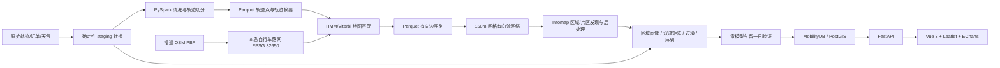

# 项目总体计划

## 一、项目定位与边界

项目名称：

> 厦门本岛工作日早高峰共享单车的源汇区域与区域间流动模式挖掘

核心目标：

1. 从五个工作日早高峰 GPS 数据中恢复可信的独立轨迹，并匹配到 OSM 有向自行车路网。
2. 把匹配后的有向边序列展开为网格间的有向流网络，用社区检测**从数据中划出区域**，而不是套用行政区或规则分区。
3. 刻画每个区域的**源汇属性**（订单开锁与关锁的净流）、**过境属性**（过境率与过境主方向）和**功能构成**。
4. 给出区域之间的**出行流**与**通道流**两个矩阵，并在零模型对照下识别显著流对与典型通勤链。
5. 通过跨天留一日、雨天对照和零模型检验，确认上述结构不是单日噪声。
6. 以 Spark、MobilityDB、FastAPI、Vue 覆盖课程要求的四层架构与交付物。

**结论边界**：

- 所有实例结论自带时空标签——2020 年 12 月 21 至 25 日、6:00–10:00、厦门本岛，不外推到晚高峰、周末或其他季节。
- 周一与周五各只有一个样本，星期差异只作描述，不作统计检验。
- “源/汇/过境”是对该时段流量结构的刻画，不等同于土地性质、道路等级或设施优劣。
- 订单表与轨迹表**不做逐条配对**（已验证配对率不可用），两者只在区域级并列与交叉校验。
- 一个 `BICYCLE_ID` 下混有多辆车的轨迹是本项目的推断，数据描述论文未给出解释，报告中按假设陈述。
- 天气只用于标定 12-23 为雨天对照，不用五天数据拟合天气权重。

**首版不包括**：路线推荐与导航、指定终点查询、地址搜索、实时数据、承载街道下钻图层、HDFS/YARN 集群、晚高峰或全天扩展。

**对应课程评分维度**：

| 评分维度 | 权重 | 本项目对应 |
|---|---|---|
| ① 大数据底层处理架构 | 20% | PySpark 全量清洗、轨迹切分、并行地图匹配、流网络聚合、PrefixSpan；附录留分布式集群追加项 |
| ② 数据管理适配能力 | 20% | MobilityDB 全量 `tgeompoint` 入库 + GiST 索引 + 联机时空查询 |
| ③ 数据挖掘实现与创新 | 20% | 自主实现的 HMM/Viterbi 地图匹配；流网络社区检测分区；零模型显著性；频繁区域序列 |
| ④ 架构与业务功能完整性 | 25% | 四层链路完整；三视图 + 侧栏 + 联机查询；区域源汇/过境画像与显著流对识别 |
| ⑤ 规范性与过程成果质量 | 15% | 术语表与 ADR、冻结基线、提示词日志、Git 记录、可复现的 run 产物 |

## 二、术语表

术语的唯一来源是仓库根的 `CONTEXT.md`，本节不再保留副本。它覆盖本计划用到的全部名词——轨迹、行程、有效轨迹、单元格、区域、片区、出行流、通道流、轨迹首末流、过境率 `PI_r`、方向集中度 `R`、轴向集中度 `R_axial`、承载街道、分析几何与成图几何——并额外定义了管线侧的切分、硬剔除、阶段、运行、内容摘要、基线与数据契约。

一个词只在一处定义：本计划负责论证「为什么这样做」，`CONTEXT.md` 负责规定「这个词指什么」。两者冲突时以 `CONTEXT.md` 为准。

## 三、数据契约与口径

### 3.1 数据规模

| 数据 | 规模 | 说明 |
|---|---|---|
| 轨迹点 | 2,849,243 | 五个文件，12-21 至 12-25，6:00–10:00 |
| 订单事件 | 441,350 行 → 220,675 对 | 已验证五天内解锁/上锁严格交替配对，无错位 |
| 天气 | 小时级 | 12-23 的 `COCO` 为 9/17（雨），其余四天 2–5 |
| 路网 | `fujian-260901.osm.pbf` | 按本岛边界与自行车可达规则抽取 |

课程要求时空轨迹类数据不少于 10 万轨迹点，本数据集为其 28 倍。

### 3.2 坐标与投影

全流程统一 **EPSG:32650（UTM 50N）**。网格定义为纯函数 `cell_id = (floor(x/150), floor(y/150))`，与运行机器、数据顺序、中心点选择均无关。地图匹配的长度计算一并从局部近似投影换到同一投影，消除两套坐标对不齐的风险。

### 3.3 轨迹口径

切分规则（按 `source_row` 顺序，不按时间全局排序）：时间不递增、间隔超过 120 秒、相邻速度超过 12 m/s、相邻跳跃超过 1,000 米，任一成立即另起 `TRACK_ID`。

轨迹级硬剔除（沿用已校准的九条）：

- 至少 3 个点；
- 时长 60–3,600 秒；
- 匹配后路网长度至少 100 米；
- 点全部位于本岛边界（`config/xiamen-island.geojson`）100 米容差内，且匹配道路位于本岛；
- 匹配率至少 80%，剔除长时间连续无法匹配的轨迹；
- 移动范围（最远两点球面距离）至少 150 米；
- 步速小于 0.5 m/s 的点占比不超过 60%；
- 全程平均速度不超过 7 m/s；
- 推断段比例不超过 30%。

**不设质量权重**：每条通过硬剔除的轨迹一票，同一轨迹对同一区域、同一区域对每天最多贡献一次。硬剔除剔的是不可信数据，与题目无关必须保留；加权只会引入一个需要辩护的调参自由度，而区域级聚合本身已抹平个体误差。

每个过滤阶段必须同时输出保留数、拒绝数和原因，保证所有输入点可追溯。

### 3.4 订单口径

- 行程 = 相邻的（解锁, 上锁）事件对；
- 时长过滤 60–3,600 秒（与轨迹口径一致，与论文一致，预期保留约 212,630 条）；
- 起点与终点均须落在本岛边界 100 米容差内；
- OD 直线距离分三档：小于 1 km（短接驳）、1–3 km（中距）、大于 3 km（长距）。切点依据：订单中位时长 410 秒，按 3 m/s 约合 1.2 km，1 km 与 3 km 把中位数夹在中间一档，三档样本量都充足。

## 四、总体架构

| 层次 | 框架 | 职责 |
|---|---|---|
| 数据源层 | 原始文件、OSM PBF | 只读保存；记录文件哈希、日期与 OSM 快照时间 |
| Staging 层 | Python 标准库、现有转换脚本 | 伪 CSV 转 UTF-8 CSV；写入稳定 `source_row`；生成转换清单 |
| 大数据处理层 | PySpark 4.2、DataFrame/SQL、Parquet | 全量读取、字段规范化、轨迹切分、质量过滤、并行地图匹配、流网络与流矩阵聚合、PrefixSpan |
| 空间与挖掘算法层 | osmium、Shapely、pyproj、NetworkX、Infomap、leidenalg | 路网抽取、HMM/Viterbi 匹配、网格流网络、社区检测、区域后处理、画像与零模型 |
| 时空数据库层 | Docker Compose、PostgreSQL、PostGIS、MobilityDB | 轨迹时序对象、区域、流矩阵的存储与联机时空查询 |
| 服务层 | FastAPI、Pydantic、psycopg | 参数校验、数据库只读查询、序列产物读取、GeoJSON 输出 |
| 前端层 | Vue 3、TypeScript、Vite、Leaflet、ECharts | 三视图交互、双滑块、区域侧栏、弦图与方向玫瑰、框选联机查询 |
| 验证层 | pytest、Spark 数据断言、前端类型检查与构建 | 数据契约、算法约束、API 与端到端演示场景 |

PySpark 采用本地 `local[*]` 模式；需要 JDK 21 与 `JAVA_HOME`。只使用标准 DataFrame/SQL，不使用 pandas-on-Spark、Spark Connect 或 pandas UDF。MobilityDB 使用固定版本 Docker 镜像，不用 `latest`。

## 五、实现顺序与算法设计

**实施顺序**：先用 12-21 单日把「切分 → 匹配 → 网格流网络 → 分区 → 画像」整条链路端到端打通并肉眼验收区域是否合理，再固定同一组参数跑五天全量。链路不通时的返工成本，在单日上是小时级，在五天上是天级。

### 1. 固化数据契约

- 本岛边界 `config/xiamen-island.geojson` 为清洗、路网抽取、订单过滤和前端边界的唯一来源。
- 记录原始文件、转换文件、边界文件与 OSM PBF 的哈希与版本。
- 先建立小样本回归数据（沿用已有的 20 车号对照集），再跑全量。

### 2. Spark 轨迹切分与筛选

按 3.3 的规则切分与硬剔除，输出 Parquet：清洗点表、轨迹摘要表、各阶段计数与拒绝原因表。

### 3. 路网构造与并行地图匹配

- 从 OSM PBF 抽取本岛自行车可达道路，排除 `motorway`、`steps`、`construction`、`bicycle=no`、不可通行与私有道路；按 `oneway`、`oneway:bicycle` 与反向自行车道标签构造有向图。
- 匹配图为每条物理路段保留两个方向，违反 OSM 单向规则的方向不删除，只加软惩罚并标记 `is_legal_direction=False`；方向统计一律使用时间有序 GPS 推断出的匹配方向。
- 沿用已实现的 HMM/Viterbi：每点 60 米内最多 5 条候选路段，发射概率依吸附距离，转移代价依 GPS 位移与路网距离差，400 米内的空隙用最短路补齐并标记为 `inferred`。
- **并行方案**：Spark 按 `TRACK_ID` 分区，路网以广播变量下发，每个分区调用同一份匹配函数。退路：若广播内存吃不下，改为按 bbox 空间分片，每个分区只加载本片路网，跨片轨迹单独串行处理。
- 匹配结果一次性物化为 Parquet（每轨迹的有向边序列、吸附距离、匹配率、推断段比例、`path_breaks`），后续所有挖掘只读 Parquet，不重复匹配。

单日验收基线（12-21 已在 `notebooks/single_day_pipeline` 上按本节口径跑通）：路网抽出 12,359 条物理路段、24,718 条有向边、1,761.8 公里；27,933 条切分轨迹经九条硬剔除保留 14,755 条（52.8%），点匹配率 99.2%，吸附距离中位数 10.6 米、90 分位 27.3 米，匹配路径长度中位 935 米，推断段比例均值 5.0%，663 条轨迹含路径断点。

### 4. 网格流网络与区域发现

**流网络构造**：把每条轨迹的匹配有向边序列按几何展开到 150 米单元格，得到单元格之间的有向转移。流量来自匹配后的路径而非原始 GPS 点，因此保留真实路径与真实方向，且不受 GPS 抖动影响。

**去抖规则**：沿边界骑行会反复跨界，因此连续重复的单元格合并；一次“进入某区域”须满足在该区域内至少 2 个连续匹配点或至少 100 米路径长度，否则并入前一区域的停留。该规则同时用于通道流与过境判定。

**社区检测**：以 Infomap 为主。其 map equation 直接建模有向网络上的随机游走流，与“区域内部往来密集、对外稀疏”的定义严格对应；粒度由 `--markov-time` 扫描控制。

**粒度选择**：在 markov-time 网格上扫描，对每个取值计算四个晴天两两独立划分的相似度均值。相似度不能直接取最大值——粗粒度天然更容易复现，AMI 有相当一部分来自格网的四邻接骨架而非流量结构，因此同时跑一个保留链路集合、只重排链路权重的零模型，以真实 AMI 减零模型 AMI 的 `excess_ami` 作为判据。

粗的一侧由出行尺度封顶：区域一旦做到公里级，多数行程退化为区域内自环，出行流矩阵的非对角线被抽空。细的一侧不是「越细越好」而是**一段平台**——单日预演里 markov-time 从 0.75 到 1.75，区域中位宽度始终在 687–742 米、区域数始终在 128–141，因为这个尺度是后处理第 2 步的面积下限定的，不是 markov-time 定的；markov-time 在段内改变的只是原始社区的碎裂程度与被并掉的连通块数。

因此段内选点不能用尺度类的量：区域中位宽度几乎不动，区域数也不动、且对 markov-time 不单调。段内的判据是两条——出行流矩阵非对角线上的量（订单自环比例取最小、通道流总量取最大，二者同源于「平台内区域数最多」，算一条证据）与 `excess_ami`。两条判据在相邻取值间的差距只有百分之几，因此选定前须换若干随机种子重跑候选粒度，确认排序不是单次社区检测的产物。

单日预演的结论是单一粒度无法同时满足三个约束——可复现、出行流矩阵非对角线还有量、区域数少到能画弦图并人工命名，因此采用**两级嵌套划分**，两级都由 Infomap 产生，后一级严格建立在前一级之上：

- **区域**：单元格流网络上 `markov_time = 1.25`，是 OD 矩阵、通道流矩阵、过境率与全部画像指标的口径单位；
- **片区**：区域为节点、区域间通道流为链路，再跑一次 Infomap（`markov_time = 0.5`），用于弦图、人工标签与前端粗粒度视图。

**确定性后处理**（四步固定顺序，每步输出前后计数）：

1. 把每个社区拆成空间连通分量；
2. 少于 14 格（0.315 km²）的分量并入与其流量往来最强的邻接区域；换格边长时按面积等价折算；
3. 填补被单一区域完全包围的孤立单元格；
4. 按格数降序重新编号；无轨迹覆盖的单元格不属于任何区域，落在其上的订单点归属最近区域，并报告这类订单占比。

**分析几何与成图几何分开**：没有流量的单元格强行入网会污染社区发现，所以它们不进入流网络，但在地图上就是孔洞。因此另出一套**只用于成图**的几何：对岛内未覆盖格做多源 BFS 就近膨胀，平局取区域号较小者，因此完全确定；补哪些格由两步判据决定——先做形态学开运算剔除窄缝，再按面积阈值把成片空地（山体、机场、湖面）排除在填充之外。全部统计量仍只基于分析几何，两套覆盖率与孔洞数分别报告。

**标签**：自动取单元内里程最长的有名道路或最大 POI 名作为候选，人工确认一次写入版本化配置。报告与答辩中“区域 7”讲不清，“火车站—湖滨南一带”才讲得清。人工标签只做到**片区**一级——区域数在百量级，逐个命名既无法人工核对也没有展示位置；区域在前端仍以编号加所在片区标识。

**冻结规则**：区域划分只在 12-21/22/24/25 四个晴天的合并数据上做一次并冻结；12-23 不参与划分，只在冻结区域下计算流量作对照。

### 5. 区域画像与流动模式

订单行程由独立的 `order-trips` 阶段按 §3.4 口径产出，第 5 步只做聚合。

对每个区域、每天、每小时切片计算：

- **源汇**：订单解锁数、上锁数、净流、单位面积强度；6–10 点分小时的源汇格局演化（是否翻转）。分小时切片按**事件各自的时间**分组——解锁记入 `unlock_time` 所在小时，上锁记入 `lock_time` 所在小时，于是某小时某区域的净流就是该小时内实际发生的上锁减解锁，即区域自行车存量的小时变化；跨小时行程的两个事件分别落在各自的小时里，全岛分小时净流因此不为零。偏差方向须声明：窗口止于 10:00 且订单表只保留两端都在窗口内的行程，09:50 之后的解锁被系统性漏记，同期上锁不受影响，末尾一小时的净流入偏高。
- **过境**：`PI_r` = 穿越该区域的轨迹中首末区域均不为该区域的比例。偏差方向必须声明——6:00/10:00 硬截断与断线会让过境率**偏高**；因此附稳健性检查：只用完整落在 6:30–9:30 的轨迹重算，看区域过境率排序是否稳定。订单事件密度作为独立旁证（过境率高的区域应同时表现为单位面积开关锁少、穿越多），**两者不相除**。
- **过境主方向**：每条过境轨迹取“进入点 → 离开点”的向量方位，按轨迹数加权落入 16 个方位扇区，画弦方向玫瑰；同时给出方向集中度 `R`（圆统计合成向量长度）。一片城市快速路应表现为高 `PI_r` 且高 `R`，两个数放在一起即为该判断的量化确认。另给轴向集中度 `R_axial`（过境弦方位角加倍后的合成向量长度），使一条两个方向都有人骑的走廊不被有向 `R` 判成没有方向。
- **功能构成**：从 OSM 提取住宅、商业办公、教育、交通枢纽的 POI 与 landuse，算区域功能构成向量。只用于解释源汇标签，不作为标签或训练真值；并给出可量化检验——净流入强度与“就业+教育类占比”的相关系数。

区域之间计算两个矩阵：

- **出行流矩阵**（订单）：解锁点区域 → 上锁点区域；
- **通道流矩阵**（轨迹）：匹配路径穿越的区域序列的相邻转移。

两者并列可回答纯统计做不出的问题：哪些区域对出行流大而通道流小（直达型），哪些区域对通道流远大于出行流（过路型）。

另出**轨迹首末流**（每条有效轨迹的首区域 → 末区域），不作第三个业务矩阵，只用于与出行流在共享区域对上做代表性对照，量化「轨迹能代表订单」这一前提——通道流的全部结论都建立在它之上。

### 6. 频繁区域序列

用 Spark MLlib 的 PrefixSpan 挖掘频繁区域序列：item = 区域 ID，序列 = 该轨迹依次穿越的区域（连续重复已在去抖阶段合并）。切段点有两个：路径断点，以及每一个无区域段（`gap_before = true`）——切断两侧即使区域相同也不合并（ADR-0009）。序列若不在无区域段处切开，就会含一个 `flow_channel` 里根本不存在的相邻关系，同一份 `track_regions` 会长出两个口径。每段长度不小于 2 才成为一条区域序列。支持度按「含该模式的区域序列条数」计，同一条序列内重复出现只算一次；一条轨迹被切成多段时因此可能投出多票（实测每轨迹 1.03 条、偏差约 3%），这是 §3.3「一票制」的显式例外（ADR-0013）。

挖掘分两个作用域，各挖各的：**晴天集合并**（四个晴天的全部序列，主结果）与**逐日五天**（含 12-23，只作跨天与雨天描述）。合并版不能由逐日版求和得到——低于当日门槛的模式在逐日结果里已经丢了。

阈值口径是「主表按 0.0002 一档挖到底、逐日加绝对下限 10、报告与 API 默认按 0.001 过滤」。支持度是精确计数，高阈值模式集必然是低阈值的子集，所以挖到最低档等于把阈值变成消费侧的过滤参数：一次运行同时服务默认展示与需要长链的场合，而不同阈值下的模式条数由主表聚合得到，不可能与主表对不上。逐日五天用统一的绝对门槛是有意的：0.0002 × 当日有效轨迹只有 1.1–5.1，门槛掉到 1 时所有子序列都频繁、组合爆炸；统一门槛让五个模式集用同一把尺子，跨天重合率才有意义，代价是繁忙日与雨天的相对门槛不同，报告里要说一句。两处口径必须换算后再写入 Spark：`minSupport` 是相对**输入行数**的比例，而序列条数多于轨迹数（切段），所以传入值不等于阈值本身；又因 MLlib 的实际门槛是 `ceil(行数 × minSupport)`，直接传 `k / n` 在浮点误差下可能得到 `k + 1`，故传的是 `(绝对门槛 − 0.5) / 序列条数`。`items` 须包成单元素 itemset。报告支持度分布、六档阈值下的模式条数，以及每个作用域的绝对门槛、序列条数与传给 Spark 的 `minSupport` 三个数并列，使阈值选择本身可审计。

PrefixSpan 挖的是**允许跳过中间区域**的子序列，而地图匹配得到的区域序列本身是连续路径，两者不是同一个对象：走廊归因只能用连续子序列，PrefixSpan 的完整输出更接近「常见起讫组合」，报告中须同时给出两个计数并标注每条模式是否连续。

挖掘后拿模式集回扫一遍序列库，一并产出连续支持度与按轨迹起始时段（6/7/8/9 各一列）分解的支持度，四列可加、合计等于支持度（ADR-0012）。时段分解是这遍扫描的零边际成本产物，给的是同一条链在四个时段的完整分布，而不是「某个时段里在不在阈值以上」。模式表另标区域编码（`片区人工标签-区内序号`，见 `CONTEXT.md`）与所属片区，使一条 `128 → 9 → 103 → 42` 在报告与答辩里念得出来。

### 7. 验证

**不预设成绩线阈值**，改为预注册“报告哪些指标 + 结论判定方向”；除下述序列重合率的显式例外外，各指标配对应的零模型对照：

- **区域划分稳定性**：四个晴天留一天四折（3 天训练、1 天验证），以两侧共同覆盖的匹配点为元素，比较走完四步后处理的区域，报告 AMI（主）与 ECS（辅）。唯一的划分零模型是保留单元格链路集合、只重排权重的链路权重零模型；报告 `excess_ami`，净掉格网四邻接骨架贡献。另报曝光对称对照：2v2 两侧无共享日期，3v3 两侧共享两天、只作上界。
- **流矩阵显著性**：两张矩阵各重复零模型 100 次。出行流用端点重排，精确保持起终点双边距；通道流受区域邻接支撑约束，用支撑内强度零模型，只在观测区域对上按两端出入强度的乘积分配总量，避免端点重排造出地理上不存在的对。出行流对角线不参与判定；区域对观测计数至少为 5 才进入 BH-FDR，`q = 0.05`。稳定显著指在 4/4 个晴天均显著，12-23 不进入稳定集。
- **跨天一致性**：流矩阵相关性、Top-K 区域对重合率；周一与周五的差异只作描述。
- **雨天对照**：12-23 在冻结区域下，检验流量是等比缩水还是结构改变，并按 3.4 的距离三档报告哪一类流萎缩最多。
- **粒度敏感性**：150/200/300 米格边长下只比较匹配点口径的划分相似度与区域中位宽度。各格边长先扫到最接近采纳划分区域数的一档，平局取较小 markov-time；达不到目标时取区域数最多的一档并标 `capped`。`min_cells` 按面积等价向上取整，200/300 米分别为 8/4。150 米恒等行作自检；跨格边长不直接比较区域数。曾产出的出行流 Top-K 重合率无效：不同格边长的划分会独立重编号 `region_id`，在没有空间对应关系时直接比较区域编号对没有意义，因此该指标及相关结论已排除；通道流也不跨格边长比较。
- **算法一致性**：Leiden 使用有向带权的 `RBConfigurationVertexPartition`，扫描 γ 后取后处理区域数最接近采纳划分的一档（平局取较小 γ），报告 AMI 与 element-centric 相似度；γ=1 原样档并列报告，避免把尺度对齐误读成 Leiden 天然产出相同区域数。
- **雨天参与划分的敏感性**：另附一次含 12-23 的划分，报告它与冻结划分的相似度。
- **频繁区域序列的跨天与雨天重合**：报告晴天逐日模式集两两 Jaccard、每日对晴天合并集的覆盖率、12-23 对该合并集的覆盖率，以及按连续支持度排序的 Top-50 连续模式重合率；再用统一相对门槛重算作旁证。这一项不配零模型：随机化序列库后长模式必然消失、重合率必然接近 0，结论预先已知，不构成有效对照。

阈值一旦拍出来就会被追问“为什么是这个数”；零模型对照给的是参照系而不是及格线，更站得住。

本节的预注册落在 `.scratch/validation-and-null-models/spec.md` 的「预注册：报告哪些指标与判定方向」，不新增独立文档。

## 六、Web 接口与交互

### 6.1 存储

Parquet 运行产物及其内容摘要是唯一事实来源；MobilityDB 是同一冻结运行的单版本只读发布副本。数据库只保留一个活动发布版，离线导入在单个事务中整库替换，失败则回滚；不做多版并存或增量更新。区域、片区、画像、流和轨迹由 Web API 直接查询数据库，不再生成预计算 GeoJSON。频繁区域序列不入库，API 继续读取现有 Parquet 产物并核对冻结划分摘要。表结构用有序 SQL 管理，导入器用 `pyarrow` 读取现有产物、用 `psycopg` 批量写入，不引入 ORM 或迁移框架。

MobilityDB 只入库通过全部九条硬剔除的有效轨迹。五天实测为 76,958 条有效轨迹、2,119,826 个有效轨迹匹配点和 85,559 个匹配路径片段。`tgeompoint` 沿完整的地图匹配道路路径构造：根据观测点时间与路径偏移给道路顶点线性插值时间，路径断点切成多个 sequence，再合成 sequence set，不用直线跨过未知缺口。原始无时区时间按 `Asia/Shanghai` 解释为带时区时间，并单存当地 `source_date`。几何与 `tgeompoint` 仅存 EPSG:32650，对外输出时再转 EPSG:4326；`track.trajectory` 建 GiST 时空索引。

Docker Compose 固定使用 `mobilitydb/mobilitydb:16-3.5-1.3`，不用 `latest`。官方镜像为 `linux/amd64`，本机 ARM 环境先用 Docker 仿真；只有在本机 5 秒联机查询验收失败时，才改为本地构建 ARM64 镜像。

| 表 | 内容 |
|---|---|
| `dataset_release` | 单行活动发布版：数据库结构版本、整体及分组内容摘要、冻结划分摘要与导入时间 |
| `track` | 有效轨迹的 `tgeompoint`、当地日期、时长与质量指标 |
| `grid_cell` | 冻结划分的分析单元格，以 `(cell_x, cell_y)` 为主键并外键关联 `region_id` |
| `region` | 区域多边形、面积、覆盖格数、所属片区与静态功能构成；另存一份只用于成图的填充后多边形 |
| `district` | 片区多边形、人工确认的标签与面积；成员关系只由 `region.district_id` 表达 |
| `region_metric` | 每区每日每时段的源汇、`PI_r`、`R`、`R_axial` 与方向扇区计数 |
| `flow_od` | 区域对出行流（按日、按时段） |
| `flow_channel` | 区域对通道流（按日、按时段） |
| `flow_significance` | 区域对的全部已检验结果，包含不显著、被门槛挡住、自环与 `clear-days-stable` 稳定集行 |

`region_metric` 是稠密表，固定有 151 区 × 5 天 × 4 时段 = 3,020 行：无事件时计数写 `0`，无法计算的比率或方向写 `NULL`。`flow_od` 与 `flow_channel` 是稀疏表，只存非零区域对，缺少的键表示流量为 `0`。`flow_significance` 中缺少的键表示未检验，不表示检验后不显著。成图填充单元格不单独入库，只由 `region` 的成图几何承载。

### 6.2 接口

| 接口 | 职责 |
|---|---|
| `GET /api/regions` | 直接查询区域、片区与每日每时段指标；一次返回全部 20 个指标切片、本岛边界、成图几何与地图锚点 |
| `GET /api/flows` | 直接查询出行流或通道流并关联 `flow_significance`；未选日期时由 `clear-days-stable` 决定成员，流量取当前时段四个晴天的每日均值 |
| `GET /api/sequences` | PrefixSpan Top-N 频繁区域序列，读取 Parquet、不入库；只返回达到连续支持度门槛且所有步骤相邻的模式 |
| `POST /api/tracks/query` | **联机时空查询**：区域或矩形 + 左闭右开时间窗，MobilityDB 返回窗内与查询空间相交的唯一有效轨迹数与示例轨迹 |
| `GET /api/health` | API、数据库、扩展、单行发布身份、本岛边界、序列产物与冻结划分摘要可用性 |

空间数据仍以 GeoJSON 作为 WGS84 HTTP 响应格式，但不保存第二份 GeoJSON 发布物。`/api/regions`、`/api/flows` 与 `/api/tracks/query` 直接读取 MobilityDB；`/api/sequences` 读取现有 Parquet。首版不加缓存、压缩或额外聚合表，只有真实 HTTP 性能验收不达标时才针对瓶颈处理。

轨迹查询支持两种互斥的查询空间：`region_id` 使用区域分析几何，矩形使用 WGS84 的 `west/south/east/north`。查询先把 `track.trajectory` 限制到时间窗，再判断与查询几何是否相交，按唯一 `TRACK_ID` 计数。结果包含纯经过、以查询空间为起点或终点、以及已知路径全部落在其中的轨迹，不做类型分类。几何最多返回 200 条时间窗内的完整匹配轨迹，保留查询空间外的上下文。

未选日期的流视图不直接使用 `flow_significance.observed`：该字段是四个晴天的全天总和，与某一时段的单日流量不可比。此时 `clear-days-stable` 只筛出四天均显著的区域对，弧线与弦图权重由 API 对 `flow_od` 或 `flow_channel` 的当前时段求四个晴天的每日均值，某日缺少的稀疏键按 `0` 参与平均；不新增稳定集聚合流表。

### 6.3 前端

三个标签页 + 一个侧栏 + 一个联机查询：

- **源汇地图**（主视图）：区域按净流填色；日期滑块（5 天）与时段滑块（6–10 点）；点击区域弹出侧栏，侧栏内含源汇数、`PI_r`、方向玫瑰、功能构成——画像类结论全部收进侧栏，不各占一页。
- **区域间流动**：地图流弧线 + ECharts 弦图，可切换出行流/通道流，可只看显著流对。弦图按**片区**绘制，区域级流对走流弧线与列表。
- **典型通勤链**：PrefixSpan Top-N 序列在地图上串珠展示。
- **联机查询**：主视图上可选择一个区域或绘制矩形，不单独占页。

本岛边界仍以 `config/xiamen-island.geojson` 为唯一来源。地图可活动范围取本岛外接矩形向四边各扩展其宽、高的 10%；初次加载按本岛范围适配缩放，视觉留白取地图容器短边的 4%，最少 24 px、最多 64 px。用户尚未操作地图时，容器尺寸变化可以重新适配；用户已经平移或缩放后不重置视图。矩形可以覆盖岛外水域，但必须完整落在地图可活动范围内，前端与 API 各校验一次。

前端固定展示数据来源卡片：注明数据为 2020 年 12 月五个工作日早高峰（6:00–10:00），所有结论只代表该时段。局限性由产品显式声明，而非事后解释。

## 七、文档、Vibe Coding 与验收材料

课程文档以仓库中的本计划、`CONTEXT.md` 与 ADR 为事实来源，Matt Pocock 工作流用于执行。开发顺序：更新并评审计划 → `to-spec` 生成执行快照 → `to-tickets` 拆纵向切片 → `implement` 实现测试提交 → code review 并更新基线、ADR 与提示词日志。

三份文档各管一件事，互不重叠：计划论证「为什么这样做」，`CONTEXT.md` 规定「这个词指什么」，`docs/adr/` 记录「当时为什么这样选、放弃了什么」。

必须长期保存：

- `docs/project-plan.md`：本计划。
- `CONTEXT.md`：术语的唯一来源。
- `docs/adr/`：难回退且有真实取舍的决策记录。
- `config/baselines.json`：各阶段冻结的期望数字。它进 Git，因此干净克隆也能拿到后续实现的交叉验证依据。
- `.scratch/` 下的 issue tracker 记录，包括 spec、ticket。
- 本地 ticket 历史、Git 提交历史与 code review 结论。
- `artifacts/runs/<run-id>/`：不提交 Git 的大体积运行配置、日志、指标与可视化；关键数字同步到 `config/baselines.json`。

探索性 notebook 保留为研究证据，正式逻辑进入可测试模块，Web 服务不得直接执行 notebook。

**验收条件**：

- 有效轨迹点远超课程要求的 10 万（全量 2,849,243）。
- 同一输入与配置重复运行时，阶段计数与结果哈希一致；网格定义与运行环境无关。
- 保留轨迹与路网全部位于本岛，且不含自行车禁行边。
- 全量地图匹配率不低于 90%，吸附距离中位数不高于 20 米。
- 区域后处理四个步骤各自输出前后计数；无覆盖单元格上的订单占比有报告。
- 每个区域可追溯到每日源汇、`PI_r`、`R` 与功能构成；每个区域对可追溯到每日出行流与通道流。
- 粒度选择的扫描曲线与零模型 `excess_ami`、两级划分的嵌套关系与每级单元数完整报告。
- 分析几何与成图几何各自的岛内覆盖率、孔洞数与多部件数分别报告。
- 验证：150/200/300 米的匹配点 AMI 与区域中位宽度完整报告；跨格边长 Top-K 出行流不作为有效指标。
- 验证：Infomap 与 Leiden 的划分相似度完整报告。
- 四折留一日相似度、链路权重零模型的 `excess_ami` 与曝光对称对照同时报告。
- 流矩阵零模型重复 100 次，两张矩阵的零模型构造分别声明，并给出 z 值与显著流对清单。
- 雨天对照按三档距离报告结构变化，不只报告总量降幅。
- 频繁区域序列的跨天与雨天重合率完整报告。
- PrefixSpan 报告支持度分布、不同阈值下的模式条数、Spark `minSupport` 的换算值、每条模式是否为连续子序列，以及每条模式按出发时段的支持度分解。
- 净流入强度与“就业+教育类占比”的相关系数有具体数值。
- 真实 HTTP 验收包含数据库查询、GeoJSON 转换、JSON 序列化与完整响应读取：区域、流、序列和健康接口各在本机 1 秒内返回；小框 15 分钟、中框 1 小时与大框 4 小时三组轨迹查询各在 5 秒内返回。
- 前端完成三视图、双滑块、区域侧栏、弦图、方向玫瑰与框选联机查询。
- 计划、`CONTEXT.md`、ADR、`config/baselines.json`、提示词、ticket、测试与提交之间可完成追溯。

## 附录 A：Spark 分布式集群（进度富余时的追加项）

课程评分原文为“真实分布式集群优于单机”。当前数据规模用 `local[*]` 已经足够，故不作为主线。若进度富余，用 Docker Compose 起 Spark standalone（1 master + 2–3 worker），与 MobilityDB 容器同一个 compose 文件，代码不变、只改 master URL，并在演示时展示 Spark UI 的 worker 分布。
